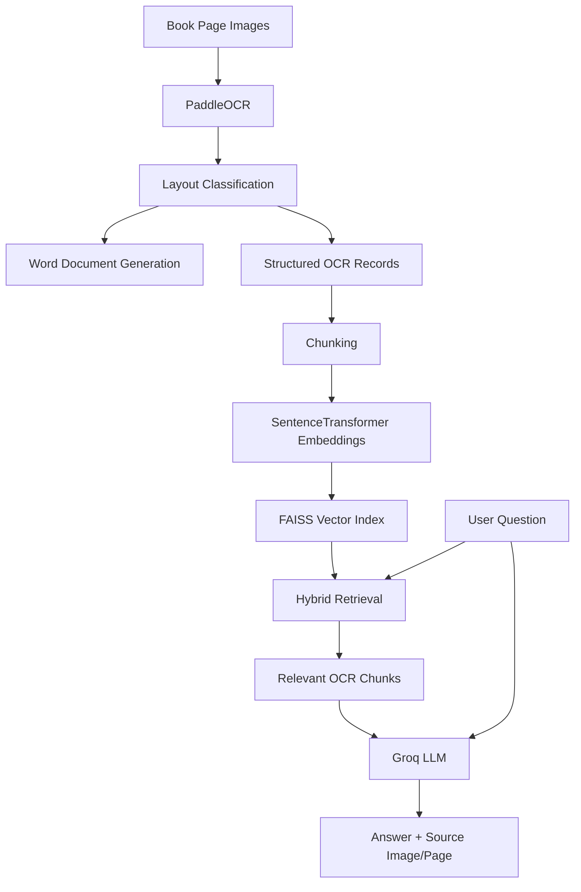

# Book OCR + RAG Question Answering System

An end-to-end OCR and Retrieval-Augmented Generation (RAG) project that converts scanned or photographed book pages into editable Microsoft Word documents and allows users to ask natural-language questions about the extracted content.

The system combines **PaddleOCR**, document-layout processing, **SentenceTransformers**, **FAISS**, hybrid retrieval, and the **Groq API** to generate answers grounded in the scanned pages.

---

## Overview

This project solves two related problems:

1. Convert book-page images into structured, editable Word documents while preserving useful layout information such as headings, code, tables, and figures.
2. Build a searchable knowledge base from the OCR output so users can ask questions and receive answers together with the source image and page.

The project uses a RAG pipeline rather than training a large language model from scratch.

---

## Features

- OCR extraction from photographed or scanned book pages
- Full-page OCR plus overlapping-strip OCR for improved text recovery
- Recursive folder processing
- Automatic page ordering using image capture time when available
- Heading, subheading, paragraph, code, and page-number classification
- Table detection
- Figure detection
- Editable `.docx` generation
- Structured OCR export to JSONL
- Heading-aware text chunking
- Local SentenceTransformer embeddings
- Local FAISS vector search
- Hybrid semantic + lexical retrieval
- Groq-powered answer generation
- Source image and page references for answers
- Support for multiple nested input folders
- Local storage of OCR records, chunks, and vector indexes

---

## Architecture



### Pipeline

```text
Images
  ↓
main.py
  ↓
Word documents + ocr_blocks.jsonl
  ↓
build_chunks.py
  ↓
chunks.jsonl
  ↓
build_index.py
  ↓
SentenceTransformer embeddings + FAISS
  ↓
ask.py
  ↓
Question → relevant OCR passages → Groq → answer + source
```

---

## Project Structure

```text
book-ocr-rag/
├── main.py
├── build_chunks.py
├── build_index.py
├── search_index.py
├── ask.py
├── requirements.txt
├── .env.example
├── .gitignore
│
├── src/
│   ├── __init__.py
│   ├── preprocess.py
│   ├── ocr.py
│   ├── layout.py
│   ├── figure_detector.py
│   ├── table_detector.py
│   ├── word_generator.py
│   ├── multi_page_word_generator.py
│   ├── knowledge_exporter.py
│   ├── chunker.py
│   └── vector_index.py
│
├── knowledge_base/
│   ├── ocr_blocks.jsonl
│   ├── chunks.jsonl
│   └── vector_index/
│       ├── chunks.faiss
│       ├── chunk_metadata.jsonl
│       └── manifest.json
│
└── docs/
    └── Book_OCR_RAG_Complete_Setup_and_User_Guide.docx
```

> `knowledge_base/`, `.env`, virtual environments, generated Word files, and source book images should normally be excluded from GitHub using `.gitignore`.

---

## Technology Stack

| Component | Technology |
|---|---|
| Programming language | Python 3.11 |
| OCR | PaddleOCR |
| Image processing | OpenCV |
| Word generation | python-docx |
| Image metadata | Pillow |
| Embeddings | SentenceTransformers |
| Embedding model | `sentence-transformers/all-MiniLM-L6-v2` |
| Vector search | FAISS |
| Retrieval | Hybrid semantic + lexical retrieval |
| LLM API | Groq |
| LLM | `openai/gpt-oss-120b` |
| Configuration | python-dotenv |

---

## Installation

### 1. Clone the repository

```bash
git clone https://github.com/YOUR_USERNAME/book-ocr-rag.git
cd book-ocr-rag
```

Replace `YOUR_USERNAME` with your GitHub username.

### 2. Create a virtual environment

The project was developed using **Python 3.11**.

#### Windows PowerShell

```powershell
python -m venv bookocr_env
```

If PowerShell blocks activation:

```powershell
Set-ExecutionPolicy -Scope Process -ExecutionPolicy RemoteSigned
```

Activate the environment:

```powershell
.\bookocr_env\Scripts\Activate.ps1
```

### 3. Install dependencies

```powershell
python -m pip install --upgrade pip
pip install -r requirements.txt
```

If the RAG packages are not yet included in `requirements.txt`, install them with:

```powershell
pip install sentence-transformers faiss-cpu groq python-dotenv
```

---

## Environment Configuration

Create a `.env` file in the project root.

You can copy `.env.example` and rename the copy to `.env`.

```env
GROQ_API_KEY=YOUR_GROQ_API_KEY_HERE
GROQ_MODEL=openai/gpt-oss-120b

TOP_K=5
MIN_SIMILARITY=0.30
MAX_CONTEXT_CHUNKS=3
```

### Important

Never commit your real `.env` file or API key to GitHub.

The public repository should contain only `.env.example`.

---

## Preparing Input Images

The system can process one folder or a recursively nested folder structure.

Example:

```text
World/
├── world_page_1.jpg
├── world_page_2.jpg
│
├── India/
│   ├── india_page_1.jpg
│   ├── india_page_2.jpg
│   │
│   └── Kashmir/
│       ├── kashmir_page_1.jpg
│       └── kashmir_page_2.jpg
│
└── France/
    ├── france_page_1.jpg
    └── france_page_2.jpg
```

Each folder is processed independently.

```text
World/                  → World.docx
World/India/            → India.docx
World/India/Kashmir/    → Kashmir.docx
World/France/           → France.docx
```

Images inside child folders are not mixed into the parent folder's Word document.

### Supported image formats

```text
.jpg
.jpeg
.png
.bmp
.tif
.tiff
```

---

## Configure the Input Folder

Open `main.py` and change `ROOT_DIRECTORY` to the folder containing the image collection.

```python
ROOT_DIRECTORY = Path(
    r"C:\Users\YourName\Desktop\World"
)
```

Only the root path normally needs to be changed before processing a new collection.

---

## Running the Complete Pipeline

For a new or modified image collection, run the following files in order.

### Step 1 — OCR and Word Generation

```powershell
python main.py
```

This stage:

- reads the images
- sorts them by capture time when available
- performs OCR
- classifies text blocks
- detects tables and figures
- generates Word documents
- exports structured OCR records

Main knowledge output:

```text
knowledge_base/ocr_blocks.jsonl
```

Example terminal output:

```text
Knowledge records saved: 290
Knowledge file:
C:\...\book_to_word\knowledge_base\ocr_blocks.jsonl
```

### Step 2 — Build RAG Chunks

```powershell
python build_chunks.py
```

This combines related OCR blocks into larger passages suitable for retrieval.

Output:

```text
knowledge_base/chunks.jsonl
```

Example:

```text
OCR records read: 290
Chunks created: 20
```

### Step 3 — Build Embeddings and FAISS Index

```powershell
python build_index.py
```

This stage loads the SentenceTransformer model, creates embeddings, normalizes them, and stores them in FAISS.

Outputs:

```text
knowledge_base/vector_index/
├── chunks.faiss
├── chunk_metadata.jsonl
└── manifest.json
```

The embedding model may be downloaded automatically on the first run.

### Step 4 — Ask Questions

```powershell
python ask.py
```

Example:

```text
Question: What is the advantage of interactive mode?

Retrieved context:
  1. i5344603525.jpg | page 9 | ...

ANSWER
The advantage of interactive mode is that you can obtain help
on Python constructs that are not objects.

Sources:
1. i5344603525.jpg — Page 9
```

Type `exit` to close the question-answering program.

---

## Testing Retrieval Without the LLM

```powershell
python search_index.py
```

This performs local retrieval without sending a request to Groq and is useful for checking whether the correct OCR chunks are being retrieved.

---

## How Retrieval Works

### Semantic Search

The question and OCR chunks are converted into embeddings using:

```text
sentence-transformers/all-MiniLM-L6-v2
```

FAISS searches for chunks whose embeddings are semantically similar to the question.

### Lexical Search

Exact words and phrases from the question are also matched against chunk text. This helps with titles, names, headings, programming terms, and exact phrases.

### Hybrid Ranking

The semantic and lexical scores are combined to rank the most relevant chunks. Only the strongest retrieved passages are sent to the LLM.

---

## RAG Answer Generation

```text
User Question
      ↓
SentenceTransformer
      ↓
FAISS + lexical retrieval
      ↓
Top relevant OCR chunks
      ↓
Groq API
      ↓
Final answer
      ↓
Source image + page
```

The LLM is instructed to answer only from the supplied OCR context. If sufficient information is not present, the system should say that it could not find enough information in the scanned pages.

---

## Output Files

### Word Documents

Word documents are saved inside the same folders as their input images.

```text
World/
├── page_1.jpg
├── page_2.jpg
└── World.docx
```

### OCR Knowledge Records

`knowledge_base/ocr_blocks.jsonl` contains structured information such as OCR text, source image, folder, page number, block number, block type, confidence, coordinates, and capture time.

### RAG Chunks

`knowledge_base/chunks.jsonl` contains larger searchable passages together with source metadata.

### Vector Index

`knowledge_base/vector_index/` contains the FAISS index and metadata used during retrieval.

---

## When to Rebuild the Pipeline

| Situation | Commands |
|---|---|
| Ask more questions from the same data | `python ask.py` |
| Add or replace page images | `main.py → build_chunks.py → build_index.py → ask.py` |
| Change chunking logic | `build_chunks.py → build_index.py → ask.py` |
| Change only retrieval logic | Usually `python ask.py` |
| Process a different image collection | Change `ROOT_DIRECTORY`, then rebuild the full pipeline |

---

## OCR Quality Recommendations

- Photograph the full page
- Keep the camera directly above the page
- Use bright and even lighting
- Avoid shadows
- Avoid motion blur
- Keep pages as flat as possible
- Use high-resolution original images
- Avoid compressed social-media copies
- Do not crop important text, tables, diagrams, or page numbers

---

## Limitations

- OCR accuracy depends heavily on image quality.
- Complex mathematical equations can still be misread.
- Code containing unusual symbols may contain OCR errors.
- Very curved, dark, blurry, or low-resolution pages reduce recognition quality.
- Incorrect OCR can affect retrieval accuracy.
- The current final answer generator requires internet access.
- Groq API availability, models, and usage limits may change.
- Visual questions about diagrams or objects are not yet fully handled by the text-only RAG pipeline.
- The current terminal interface is functional but not yet a full graphical chat application.

---

## Privacy and Security

The complete OCR output, chunks, embeddings, FAISS index, and source metadata are stored locally.

When `ask.py` is used, selected relevant OCR passages and the user's question are sent to the configured Groq API for final answer generation.

Do not commit the following to a public repository unless you intentionally want to publish them:

```text
.env
bookocr_env/
.venv/
knowledge_base/
source book images
generated Word documents
```

---

## Future Improvements

- Streamlit or web-based chat interface
- Conversation memory
- Multimodal question answering for diagrams and figures
- Local LLM mode without an external API
- Source-image preview
- Highlighting the exact source region used for an answer
- Cross-page context handling
- Retrieval reranking
- Improved mathematical OCR
- Stronger code reconstruction
- Automatic incremental indexing
- Resume/checkpoint support for large OCR jobs

---

## Detailed Setup Guide

A full beginner-friendly Windows setup guide can be included in:

```text
docs/Book_OCR_RAG_Complete_Setup_and_User_Guide.docx
```

---

## Author

**Sharmeen Aehsaan**

MCA graduate interested in Machine Learning, Artificial Intelligence, Deep Learning, and Software Development.

---

## Disclaimer

This project is intended for educational, research, and document-processing use. Ensure that you have permission to process and store the source documents used with the system.
