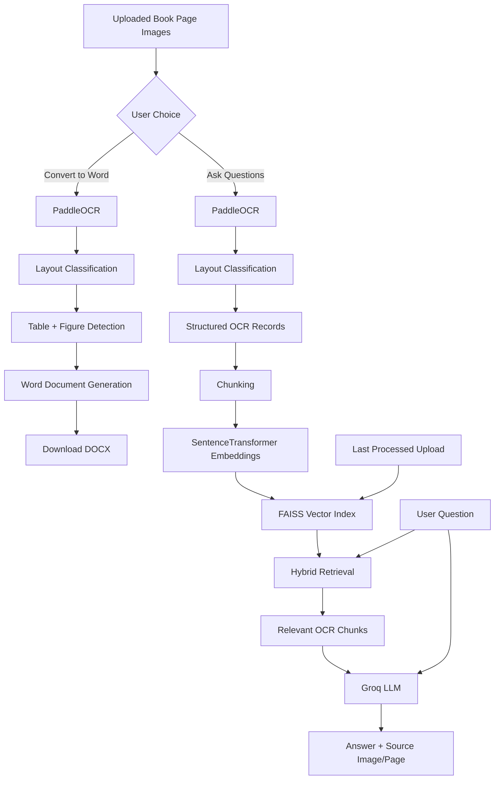

# Intelligent Book OCR + RAG

An end-to-end Python application that converts scanned or photographed book pages into editable Microsoft Word documents and also allows users to ask natural-language questions about the extracted content.

The project combines **PaddleOCR**, document-layout processing, **SentenceTransformers**, **FAISS**, hybrid retrieval, the **Groq API**, and a **Streamlit user interface**.

---

## Overview

This project supports two main workflows:

1. **Convert uploaded book-page images into an editable Word document**
2. **Ask questions directly from uploaded book pages using OCR + RAG**

The Streamlit interface runs only the processing required for the option selected by the user.

The system uses Retrieval-Augmented Generation (RAG) instead of training a large language model from scratch.

---

## Main Features

- Upload one or multiple scanned or photographed book pages
- Streamlit graphical interface
- PaddleOCR text extraction
- Full-page OCR plus overlapping-strip OCR
- Layout classification for headings, subheadings, paragraphs, code, and page numbers
- Table detection
- Figure detection
- Editable `.docx` generation
- Structured OCR export to JSONL
- Heading-aware text chunking
- SentenceTransformer embeddings
- Local FAISS vector search
- Hybrid semantic + lexical retrieval
- Groq-powered question answering
- Source image and page references
- Continue asking questions from the **last processed upload**
- Recursive folder processing through the original CLI workflow
- Local storage of OCR records, chunks, and FAISS index

---

## Streamlit Application Flow

```text
WELCOME
   │
   ├── Upload New Images
   │       │
   │       ├── Convert to Word
   │       │       └── OCR + layout + tables/figures + Word generation
   │       │
   │       └── Ask Questions
   │               └── OCR + knowledge export + chunks + FAISS + chat
   │
   └── Ask From Last Processed Upload
           └── Load existing FAISS index + chat
```

### Important Processing Behavior

**Convert to Word**

Runs only the OCR and Word-document pipeline.

It does **not** rebuild the RAG knowledge base.

**Ask Questions from new images**

Runs OCR and the RAG preparation pipeline.

It does **not** create a Word document.

**Ask From Last Processed Upload**

Loads the most recent existing FAISS index and opens the chat directly.

It does **not** rerun OCR, chunking, embeddings, or Word generation.

---

## Architecture



---

## Technology Stack

| Component | Technology |
|---|---|
| Programming language | Python 3.11 |
| User interface | Streamlit |
| OCR | PaddleOCR 2.10.0 |
| OCR runtime | PaddlePaddle 2.6.2 |
| Image processing | OpenCV |
| Plotting/debug utilities | Matplotlib |
| Word generation | python-docx |
| Image metadata | Pillow |
| Embeddings | SentenceTransformers |
| Embedding model | `sentence-transformers/all-MiniLM-L6-v2` |
| Vector search | FAISS |
| Retrieval | Hybrid semantic + lexical |
| LLM API | Groq |
| LLM | `openai/gpt-oss-120b` |
| Configuration | python-dotenv |

---

# How to Run the Streamlit App

This section is intended for a new user who downloads the project from GitHub.

## 1. Install Python

Install **Python 3.11**.

During installation on Windows, enable:

```text
Add Python to PATH
```

Check the installation:

```powershell
python --version
```

---

## 2. Clone the Repository

Open PowerShell or the VS Code terminal:

```powershell
git clone https://github.com/sharmeenaehsaan/intelligent-book-ocr-rag.git
cd intelligent-book-ocr-rag
```

If Git is not installed, the repository can also be downloaded as a ZIP from GitHub and extracted.

---

## 3. Create a Virtual Environment

```powershell
python -m venv rag_env
```

Activate it:

```powershell
.\rag_env\Scripts\Activate.ps1
```

The terminal should begin with:

```text
(rag_env)
```

If PowerShell blocks activation:

```powershell
Set-ExecutionPolicy -Scope Process -ExecutionPolicy RemoteSigned
```

---

## 4. Upgrade Installation Tools

```powershell
python -m pip install --upgrade pip setuptools wheel
```

---

## 5. Install CPU PyTorch

```powershell
python -m pip install torch --index-url https://download.pytorch.org/whl/cpu
```

---

## 6. Install Project Dependencies

```powershell
python -m pip install -r requirements.txt
```

---

## 7. Configure the Groq API Key

Create a file named exactly:

```text
.env
```

in the project root.

Add:

```env
GROQ_API_KEY=YOUR_GROQ_API_KEY_HERE
GROQ_MODEL=openai/gpt-oss-120b
TOP_K=5
MIN_SIMILARITY=0.30
MAX_CONTEXT_CHUNKS=3
```

Each user should use their own Groq API key.

Never publish the real `.env` file on GitHub.

---

## 8. Streamlit Configuration

The repository includes:

```text
.streamlit/config.toml
```

with:

```toml
[server]
fileWatcherType = "none"
```

---

## 9. Start the Application

With `rag_env` activated:

```powershell
python -m streamlit run streamlit_app.py
```

The application normally opens automatically in the browser.

If it does not, open:

```text
http://localhost:8501
```

---

## 10. Using the Application

### Upload New Images

Upload one or more supported page images:

```text
.jpg
.jpeg
.png
.bmp
.tif
.tiff
```

Then choose one of the following actions.

### Convert to Word

```text
Images
  ↓
Preprocessing
  ↓
OCR
  ↓
Layout Classification
  ↓
Table + Figure Detection
  ↓
Word Generation
  ↓
Download DOCX
```

The RAG knowledge base is **not replaced** when the user only converts images to Word.

### Ask Questions

```text
Images
  ↓
Preprocessing
  ↓
OCR
  ↓
Layout Classification
  ↓
Knowledge Export
  ↓
Chunking
  ↓
SentenceTransformer Embeddings
  ↓
FAISS Index
  ↓
Chat
```

No Word document is generated in this path.

The newly processed images become the **last processed question-answering upload**.

---

## 11. Ask From the Last Processed Upload

Choose:

```text
Ask From Last Processed Upload
```

This loads the existing knowledge base and FAISS index.

It does not rerun OCR, preprocessing, Word generation, chunking, embedding creation, or FAISS index building.

---

## 12. Asking Questions

Type a question in the chat box.

Example:

```text
What is Swing used for?
```

The system performs hybrid retrieval, selects relevant OCR chunks, sends the question plus retrieved context to Groq, and returns an answer with source image/page information.

---

## 13. Start the App Later

After the one-time installation:

```powershell
cd path\to\intelligent-book-ocr-rag
.\rag_env\Scripts\Activate.ps1
python -m streamlit run streamlit_app.py
```

If `run_app.bat` is included and the environment is named `rag_env`, a Windows user can also double-click:

```text
run_app.bat
```

---

## Original Command-Line Workflow

The original CLI workflow remains available:

```powershell
python main.py
python build_chunks.py
python build_index.py
python ask.py
```

Use:

```powershell
python search_index.py
```

to test retrieval without Groq.

---

## Privacy and Security

Never commit:

```text
.env
rag_env/
bookocr_env/
knowledge_base/
runtime/
__pycache__/
private source book images
generated Word documents
```

---

## Troubleshooting

### Check the active Python environment

```powershell
python -c "import sys; print(sys.executable)"
```

The path should point to:

```text
...\rag_env\Scripts\python.exe
```

### PowerShell activation issue

```powershell
Set-ExecutionPolicy -Scope Process -ExecutionPolicy RemoteSigned
```

### `.env` not found

Make sure the file is directly in the project root and is named exactly `.env`, not `.env.txt`.

### No previous upload available

Process a new image set using **Ask Questions** first.

---

## Limitations

- OCR accuracy depends on image quality.
- Mathematical equations and unusual symbols may be misread.
- Incorrect OCR can reduce retrieval quality.
- Groq question answering requires internet access.
- The current RAG pipeline is text-based rather than full visual reasoning.
- Only the most recently prepared question-answering upload is retained for the Streamlit previous-upload workflow.

---

## Future Improvements

- Conversation memory
- Multimodal question answering
- Source-image preview
- Exact source-region highlighting
- Local LLM mode
- Cross-page context handling
- Incremental indexing
- Resume/checkpoint support

---

## Author

**Sharmeen Aehsaan**

MCA graduate interested in Machine Learning, Artificial Intelligence, Deep Learning, and Software Development.

---

## Disclaimer

This project is intended for educational, research, and document-processing use. Ensure that you have permission to process, store, and share the source documents used with the system.
